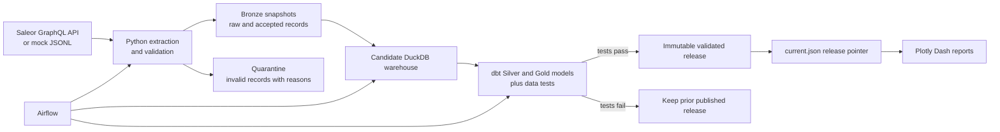

# Saleor Analytics Demo — Product Design

## 1. Purpose

This project is an interview demonstration of a small, trustworthy order-analytics product. It takes synthetic order data from a Saleor-style commerce source, validates it, turns it into reporting tables, and publishes a version that a dashboard can safely read.

The product answers a simple business question:

> How many valid orders were created each day, through which channel, and what is their gross order value in each currency?

It is designed to show the decisions behind reliable data engineering, not to imitate a full production commerce platform. All demo data is synthetic.

## 2. What a reviewer can see

| Area | What the demo shows | Why it matters |
|---|---|---|
| Reliable ingestion | JSONL files or the Saleor GraphQL API are captured before transformation. | The source can be replayed and investigated. |
| Data quality | Invalid rows go to quarantine; excessive invalid data blocks the run. | Bad source data cannot silently reach a report. |
| Safe retries | Exact duplicates are collapsed and same-input retries are safe. | A transient failure does not inflate metrics. |
| Correct updates | The current version of an order replaces its older version as a complete order plus line set. | A legitimate order update is not mistaken for a duplicate. |
| Governed publication | dbt tests run in an isolated candidate warehouse before an immutable release is published. | Dashboard users keep the last known-good version when a build fails. |
| Business consumption | Plotly Dash reports filter by currency, channel, and date. | The outcome is visible to a non-engineering audience. |
| Operational control | Airflow shows the ordered workflow; GitHub Actions validates pull requests. | The process can be operated and changed with confidence. |

## 3. Users and outcomes

| User | Need | Product outcome |
|---|---|---|
| Business stakeholder | A quick, credible view of daily order activity. | Currency-safe daily metrics in the dashboard. |
| Analyst | A reliable table to explore and reconcile. | Gold reporting models in DuckDB. |
| Data engineer | A repeatable, diagnosable pipeline. | Raw snapshots, run metadata, quarantine files, dbt artifacts, and CLI status. |
| Reviewer | Evidence that engineering controls are real. | Rehearsable scenarios for replay, update, invalid input, testing, orchestration, and CI. |

## 4. Scope and boundaries

### Included

- Saleor GraphQL extraction and local Saleor-shaped mock files.
- Bronze, Silver, and Gold data layers in a local DuckDB-based warehouse.
- Python validation, normalization, quarantine, and execution control.
- dbt transformations and data-quality tests.
- Immutable release publication, a release pointer, and a Plotly Dash dashboard.
- Airflow orchestration for the local demo and GitHub Actions quality checks.

### Deliberately not included

- Real customer data, production credentials, cloud deployment, or external alert delivery.
- Log-based CDC, hard-delete capture, or every intermediate source mutation.
- SCD Type 2 history, multi-writer concurrency, high availability, or a distributed compute engine.
- A claim that the complete Saleor plus Airflow stack is validated under a 4 GB Docker limit.

These boundaries are intentional. They keep the demo small enough to explain while leaving a clear path for production evolution.

## 5. Product flow



The flow separates **preparing a candidate** from **publishing a release**. This is the central reliability decision: a failed transformation or test cannot replace what dashboard users already see.

## 6. Data layers and business definitions

| Layer | Contents | Primary audience | Key rule |
|---|---|---|---|
| Bronze | Immutable raw and accepted JSONL snapshots, manifests, and source metadata. | Data engineering | Preserve evidence for replay and investigation. |
| Quarantine | Rejected source records and reason codes. | Data engineering | Keep invalid data out of analytics. |
| Silver | Current validated order and order-line records. | Analysts and engineers | One current row per order or line in the selected order version. |
| Gold | Daily order and product metrics. | Analysts and dashboard users | Aggregate only valid, accepted orders. |
| Release metadata | Checksums, input inventory, dbt results, and timestamps. | Engineers and reviewers | Prove which inputs and tests produced a release. |

The pipeline preserves the raw API payload in Bronze, then normalizes timestamps, money, strings, nested GraphQL structures, and field names into a controlled Silver contract.

### Runtime artifacts

`<analytics-root>` is `/opt/data` in the Airflow container. It is the configured local root when the CLI is run directly.

| Result | Location | Notes |
|---|---|---|
| Bronze raw capture | `<analytics-root>/bronze/<snapshot-id>/orders.raw.jsonl` | The source record as received, one JSON object per line. |
| Bronze accepted capture | `<analytics-root>/bronze/<snapshot-id>/orders.accepted.jsonl` | The validated, normalized records used to build the warehouse. |
| Bronze manifest | `<analytics-root>/bronze/<snapshot-id>/manifest.json` | Record counts, checksums, contract version, and snapshot metadata. |
| Silver tables | `<analytics-root>/releases/<release-id>/analytics.duckdb` | DuckDB tables `analytics.orders` and `analytics.order_lines`. |
| Gold tables | `<analytics-root>/releases/<release-id>/analytics.duckdb` | DuckDB tables `analytics.daily_order_metrics` and `analytics.daily_product_metrics`. |
| Active release pointer | `<analytics-root>/warehouse/current.json` | Identifies the validated release served by the dashboard and stores source watermarks. |
| Review export bundle | `artifacts/<release-id>/` on the host | Default location created by `export-artifacts`; includes one release and its latest source evidence. |

The primary Gold metric is **gross order value**. It is an operational measure of the source order total. It excludes `DRAFT` and `CANCELED` orders. It is not recognized revenue, net sales, payment settlement, or a cross-currency total.

Currency is always a reporting dimension. USD, EUR, and other currencies are never added together without an explicit exchange-rate policy, which this demo does not implement.

## 7. Data contract and reliability rules

A data contract is the written, testable agreement for a valid order record. It defines required IDs, timestamps, money values, currencies, statuses, line items, and accepted shapes.

| Situation | Expected behavior |
|---|---|
| Valid new order | Normalize it (for example: time conversion, currency values, and string cleanup), then retain it for transformation. |
| Malformed or invalid record | Write it to quarantine with a reason. |
| Reject rate above the configured threshold | Fail the run and do not publish. |
| Same order version and same payload | Treat as an exact duplicate and collapse it. |
| Same order/version key but different payload | Fail for investigation; never choose a winner based on arrival order. |
| A newer legitimate order update | Select the whole latest order version and its matching line set. |
| An older order version arriving late | Retain provenance but do not roll the current analytical state backward. |
| Build, dbt test, or publication failure | Preserve the previous published release and source checkpoint. |


The demo uses a five-minute overlap for incremental API polling. It uses `updatedAt` to limit the source window and cursor pagination to retrieve every matching page. Overlap intentionally creates some repeated records; the idempotency controls make those repetitions safe.

This is polling, not full CDC. It cannot prove source completeness, infer hard deletes, or guarantee capture of every intermediate change while an order is being edited.

## 8. Workflow an interviewer can follow

The following sequence is the recommended live demonstration. Run either the PowerShell or Git Bash commands from the repository root; do not mix their environment-variable syntax in one terminal. Commands and fuller expected results are in the [CLI user guide](docs/CLI_USER_GUIDE.md) and [modern demo guide](docs/MODERN_DE_DEMO.md).

1. **Prepare an isolated demo session.** Create a new local data root so the rehearsal does not alter an earlier run.

   **PowerShell**

   ```powershell
   uv sync --frozen
   $demoSession = [guid]::NewGuid().ToString('N')
   $env:ANALYTICS_ROOT = Join-Path (Get-Location) "var/interview-$demoSession"
   ```

   **Git Bash**

   ```bash
   cd /d/gaoxin_de
   uv sync --frozen
   export DEMO_SESSION="$(date +%Y%m%d-%H%M%S)"
   export ANALYTICS_ROOT="$(pwd -W)/var/interview-$DEMO_SESSION"
   ```

2. **Create a baseline.** Generate 20 synthetic orders, ingest them, and build a warehouse release. Expected Gold total: 20 USD orders and USD 400.00 gross order value.

   **PowerShell**

   ```powershell
   uv run saleor-analytics mock-data "$env:ANALYTICS_ROOT/mock/base.jsonl" --count 20
   uv run saleor-analytics ingest-file "$env:ANALYTICS_ROOT/mock/base.jsonl" --snapshot-id base
   uv run saleor-analytics build-warehouse --release-id base
   ```

   **Git Bash**

   ```bash
   uv run saleor-analytics mock-data "$ANALYTICS_ROOT/mock/base.jsonl" --count 20
   uv run saleor-analytics ingest-file "$ANALYTICS_ROOT/mock/base.jsonl" --snapshot-id base
   uv run saleor-analytics build-warehouse --release-id base
   ```

3. **Show trust evidence.** Run `status`, inspect the release metadata, and open the dashboard.

   **PowerShell**

   ```powershell
   uv run saleor-analytics status
   Get-Content "$env:ANALYTICS_ROOT/warehouse/current.json" -Raw
   uv run saleor-analytics dashboard --port 8051
   ```

   **Git Bash**

   ```bash
   uv run saleor-analytics status
   cat "$ANALYTICS_ROOT/warehouse/current.json"
   uv run saleor-analytics dashboard --port 8051
   ```

   Open `http://localhost:8051`. Keep Dash running in this terminal. In a second terminal, return to the repository and set the same data root before continuing.

   **PowerShell, second terminal**

   ```powershell
   $env:ANALYTICS_ROOT = 'D:\gaoxin_de\var\interview-<session-id-from-the-first-terminal>'
   ```

   **Git Bash, second terminal**

   ```bash
   cd /d/gaoxin_de
   export ANALYTICS_ROOT='D:/gaoxin_de/var/interview-<session-id-from-the-first-terminal>'
   ```

4. **Show a safe retry.** Ingest a duplicate scenario. The source contains an extra repeated row, but reporting remains at 20 orders and USD 400.00.

   **PowerShell**

   ```powershell
   uv run saleor-analytics mock-data "$env:ANALYTICS_ROOT/mock/duplicate.jsonl" --scenario duplicate --count 20
   uv run saleor-analytics ingest-file "$env:ANALYTICS_ROOT/mock/duplicate.jsonl" --snapshot-id duplicate
   uv run saleor-analytics build-warehouse --release-id duplicate
   uv run saleor-analytics status
   ```

   **Git Bash**

   ```bash
   uv run saleor-analytics mock-data "$ANALYTICS_ROOT/mock/duplicate.jsonl" --scenario duplicate --count 20
   uv run saleor-analytics ingest-file "$ANALYTICS_ROOT/mock/duplicate.jsonl" --snapshot-id duplicate
   uv run saleor-analytics build-warehouse --release-id duplicate
   uv run saleor-analytics status
   ```

5. **Show a legitimate update.** Ingest the update scenario. One order changes from USD 20.00 to USD 30.00; the current-state total becomes USD 410.00.

   **PowerShell**

   ```powershell
   uv run saleor-analytics mock-data "$env:ANALYTICS_ROOT/mock/update.jsonl" --scenario update --count 20
   uv run saleor-analytics ingest-file "$env:ANALYTICS_ROOT/mock/update.jsonl" --snapshot-id update
   uv run saleor-analytics build-warehouse --release-id update
   uv run saleor-analytics status
   ```

   **Git Bash**

   ```bash
   uv run saleor-analytics mock-data "$ANALYTICS_ROOT/mock/update.jsonl" --scenario update --count 20
   uv run saleor-analytics ingest-file "$ANALYTICS_ROOT/mock/update.jsonl" --snapshot-id update
   uv run saleor-analytics build-warehouse --release-id update
   uv run saleor-analytics status
   ```

6. **Show controlled failure.** Ingest invalid input. The reject rate exceeds the 5% threshold, the input is quarantined, and the dashboard continues to serve the USD 410.00 release. The ingestion command is expected to exit with an error.

   **PowerShell**

   ```powershell
   uv run saleor-analytics mock-data "$env:ANALYTICS_ROOT/mock/invalid.jsonl" --scenario invalid --count 2
   uv run saleor-analytics ingest-file "$env:ANALYTICS_ROOT/mock/invalid.jsonl" --snapshot-id invalid
   Get-Content "$env:ANALYTICS_ROOT/quarantine/invalid/orders.rejected.jsonl"
   uv run saleor-analytics status
   ```

   **Git Bash**

   ```bash
   uv run saleor-analytics mock-data "$ANALYTICS_ROOT/mock/invalid.jsonl" --scenario invalid --count 2
   uv run saleor-analytics ingest-file "$ANALYTICS_ROOT/mock/invalid.jsonl" --snapshot-id invalid
   cat "$ANALYTICS_ROOT/quarantine/invalid/orders.rejected.jsonl"
   uv run saleor-analytics status
   ```

7. **Show operating model.** Start Airflow if it is not already running, open `http://localhost:8081`, and manually trigger `saleor_analytics_daily` with the JSON below. Then point to the pull-request checks in GitHub Actions.

   **PowerShell**

   ```powershell
   docker compose -f infra/airflow/compose.yml up -d
   ```

   **Git Bash**

   ```bash
   docker compose -f infra/airflow/compose.yml up -d
   ```

   **Airflow manual-trigger configuration**

   ```json
   {"generate_mock": true, "scenario": "duplicate", "count": 20}
   ```
## 9. Operating model

The project provides a Click CLI called `saleor-analytics`. It is the main local interface for data engineers.

| Command | Purpose |
|---|---|
| `mock-data` | Generate deterministic Saleor-shaped JSONL for a demo scenario. |
| `ingest-file` | Validate a JSONL snapshot, save accepted records, quarantine invalid records, and enforce the reject threshold. |
| `extract-saleor` | Extract paginated data from Saleor’s GraphQL API. |
| `build-warehouse` | Build a candidate DuckDB warehouse, run dbt, and publish only when validation succeeds. |
| `publish-candidate` | Publish a previously validated candidate after integrity checks. |
| `status` | Show run, release, freshness, and lineage information. |
| `dashboard` | Start the local Plotly Dash reporting interface. |

Airflow models the operational dependency order:

```text
prepare → extract and validate → stage → transform and test → publish → monitor
```

It permits optional synthetic-data generation only for manual demo runs. Scheduled runs keep it disabled. The local Airflow service is an orchestration demonstration, not a high-availability deployment.

## 10. Quality, delivery, and governance

Python handles source interaction, parsing, type checks, normalization, file-level deduplication, quarantine, and workflow control. dbt owns cross-snapshot current-state selection, relational modeling, analytical aggregates, and most data assertions.

The test suite covers Python behavior, dbt builds, publication failure recovery, duplicate handling, update behavior, and invalid inputs. GitHub Actions runs formatting, linting, tests, and packaging for pull requests and the main branch. A manual production-promotion job is illustrative only; repository-level required reviewers and environment protections must be configured separately.

The project only uses synthetic data. Credentials are supplied at runtime through environment variables and must not be committed. Local files, DuckDB schemas, and Docker volumes are convenience boundaries, not access-control systems. A production implementation would add IAM, secret management, encrypted storage, retention enforcement, access audits, and alert delivery.

## 11. Why this design is appropriate

DuckDB, Python, dbt, and a local dashboard make the project easy to run on one machine and easy to review. Full rebuilds from retained accepted history are appropriate for the small demo dataset and make corrections and replay straightforward.

The design still demonstrates production-relevant principles: immutable source evidence, contracts, idempotency, isolation before publication, data tests, lineage, orchestration, and controlled delivery. The project avoids adding Spark, Kafka, Iceberg, or cloud services before a business requirement justifies their operational cost.

## 12. Production evolution

| Trigger | Likely next change |
|---|---|
| Larger data volume or slower full rebuilds | Store columnar data in object storage; incrementally process partitions. |
| Near-real-time freshness requirement | Adopt change events or log CDC with durable checkpoints and deletion/tombstone handling. |
| Need to analyze historical attribute state | Introduce SCD Type 2 validity intervals and history semantics. |
| Multiple teams or engines need shared tables | Adopt a managed warehouse or a governed lakehouse/catalog. |
| Sensitive production data | Add IAM, secret manager, encryption, retention, audit trails, and formal access policies. |
| Strict service-level objectives | Add reconciliation feeds, source manifests, alerts, runbooks, and high-availability orchestration. |

## 13. Requirement traceability

The original Principal Data Engineer Candidate Take Home document is the acceptance reference. It is maintained outside this repository; this table maps its A–F sections to repository evidence.

| Assessment area | Evidence in this repository |
|---|---|
| A. Architecture and design | This document, [README](README.md), [modern demo guide](docs/MODERN_DE_DEMO.md), and `analytics/`. |
| B. Python programming | `src/saleor_analytics/`, the Click CLI, and `tests/`. |
| C. Quality and testing | dbt models/tests in `analytics/`, Python tests in `tests/`, quarantine and release evidence under a runtime data root. |
| D. Orchestration | [Airflow DAG](dags/saleor_analytics.py) and [Airflow Compose file](infra/airflow/compose.yml). |
| E. CI/CD | `.github/workflows/` and `.gitlab-ci.yml` as the optional GitLab example. |
| F. Documentation | [CLI guide](docs/CLI_USER_GUIDE.md), [operations guide](docs/OPERATIONS.md), [verification report](docs/VERIFICATION.md), and this design document. |

## 14. Related documents

- [Runnable modern demo](docs/MODERN_DE_DEMO.md) — setup, proxy guidance, commands, scenarios, and expected results.
- [CLI user guide](docs/CLI_USER_GUIDE.md) — command reference and use cases.
- [Operations guide](docs/OPERATIONS.md) — troubleshooting and operational notes.
- [Verification report](docs/VERIFICATION.md) — executed checks and known limits.
- [Implementation plan](IMPLEMENTATION_PLAN.md) — delivery history and planned work.
