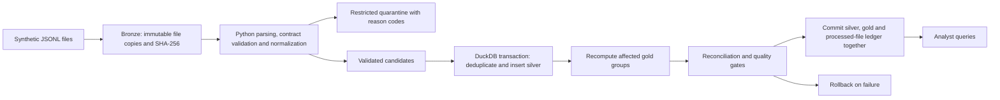

# Principal Data Engineer Demo Design

> Original design intent, including historical setup and event-domain proposals. Use the [modern DE guide](docs/MODERN_DE_DEMO.md) for current implemented behavior and the [verification report](docs/VERIFICATION.md) for tested evidence. The [assessment review](docs/ASSESSMENT_REVIEW.md) retains the earlier gap audit with a current closure update.

## Documentation requirements

Document the implemented functionality from a data engineering perspective and explicitly map it to sections A-F of `Principal_Data_Engineer_Candidate_Take_Home.md`. All documentation, code comments, CLI help and dashboard text must be in English. Documentation and demo preparation are separate from the flexible 8-14 hour AI-assisted implementation estimate. There is no strict time limit.

The README and supporting documentation must explain:

- The business questions, intended consumers, metric definitions, table grains, keys, relationships, currency handling and status inclusion rules.
- Source-to-report data flow: Saleor API extraction, bronze files, Python validation/normalization, dbt transformations and tests, DuckDB publication, and Plotly Dash consumption.
- The Click CLI: each command's purpose, inputs, outputs, configuration, examples, exit behavior and operational side effects. Distinguish synthetic data seeding from normal pipeline execution.
- Contracts, schema evolution, duplicates versus legitimate updates, late data, quarantine, quality thresholds, reconciliation and extraction completeness limitations.
- Retry, idempotency, replay/backfill, failed publication, recovery and how consumers retain access to the last validated release.
- Orchestration dependencies, freshness expectations, run metrics, source-to-output lineage and operational troubleshooting.
- CI/CD stages, branch-specific behavior, promotion gates, environment configuration and secret handling.
- Synthetic data provenance, sensitive-field handling, access boundaries, retention, security controls and local-versus-production limitations.
- Cost/performance choices, full-refresh trade-offs, measured results where available, and justified production evolution.
- Reproducible installation, sample data generation, exact run/test/report commands and expected outcomes.

Provide a requirements traceability table linking each assessment section to concrete files, commands, tests or reports. Separate implemented and verified behavior from illustrative skeletons, assumptions and future work. Report actual validation results; do not present proposed guarantees as tested functionality. Keep the README concise and route detailed model definitions, operational procedures and design decisions to supporting files where needed.

## Accepted revision: Saleor order analytics

This section supersedes the original event-source proposal and schedule below. The user selected Saleor as the source application. The current estimate is 8-14 hours of AI-assisted implementation, with no strict time limit; documentation, demo preparation and presentation are separate. Implementation tests and runtime verification remain inside it.

- Source: the official Saleor Platform Docker Compose stack, including its dashboard and GraphQL API.
- Local upstream checkout: `infra/saleor-platform`, revision `ab6315bd59c58b4815175df4c679107ff9695be4`.
- Data: synthetic commerce data, initially populated using the upstream management command. Verify API authentication, order creation and order extraction during the setup spike.
- Flow: Saleor -> Python paginated GraphQL extraction -> immutable JSONL snapshots -> Python contract validation and normalization -> candidate DuckDB staging tables -> dbt silver and gold models -> quality gates -> versioned publication.
- Python remains the primary implementation language. Retain the file-reading pipeline boundary required by the assessment.
- Orders are mutable entities, not immutable purchase/refund events. Repeated snapshots of the same source version are duplicates; newer versions are legitimate updates. Store order ID, source update time where available, payload hash, extraction time and run ID. Conflicting same-version payloads require investigation; never silently resolve them using arrival order.
- Model silver orders at one row per source order and silver order lines at one row per source line. dbt selects the current accepted order version and its complete line set together, excluding lines absent from that version. Do not select the latest version of each line independently, which could retain removed lines.
- Compute order-level totals from the orders table. Keep line-level metrics separate to prevent fanout double-counting. Define status inclusion and gross/net/tax/shipping semantics against the actual API schema before implementing gold metrics. Never combine currencies.
- Begin with full paginated snapshots for the small demo. Pagination is not automatically a consistent source snapshot; document the no-concurrent-edit demo assumption. Add incremental extraction only after verifying the installed API's filtering and ordering capabilities. Do not infer deletions from an incomplete or failed extract.
- Build silver and gold in an isolated candidate database; publish only after dbt and operational checks pass. For the small demo, fully rebuild models from retained accepted staging versions, naturally updating historical groups. Incremental materialization is deferred. Preserve replayable bronze snapshots for future transformation changes.
- Quality gates: required IDs, valid money/currency/timestamps, uniqueness by grain, order-line references, and aggregation reconciliation. Do not reuse the old event contract unchanged.
- Keep malformed-source fixtures for deterministic validation tests even if Saleor prevents invalid data from being inserted through its API.

### Accepted dbt-first implementation

Python owns authenticated API extraction, pagination, immutable file snapshots, file parsing, type validation, normalization, quarantine and execution control. It also collapses exact duplicate normalized records within an input snapshot using a documented key and payload hash, satisfying the Python component's deduplication expectation. Preserve duplicate counts and source provenance. dbt owns cross-snapshot deduplication, current-order selection, relational modeling and analytical aggregation.

Use dbt Core with the DuckDB adapter, with compatible versions pinned and verified during implementation. Most assertions belong in dbt: not-null and unique keys, accepted statuses/currencies, order-line relationships, conflicting version detection, and independent amount/count reconciliation SQL. Keep order totals separate from line aggregations to avoid fanout. Test arithmetic against hand-calculated fixtures as well as reconciliation queries.

Keep pytest focused on behavior outside dbt: malformed input and normalization, paginated extraction completeness, bounded retries, and preservation of published output after a failed run. End-to-end scenarios cover repeated input, a changed order including removed lines, and failed build followed by successful retry. This retains the assessment's required Python unit test while concentrating data logic and testing in dbt.

Proposed model layout:

```text
analytics/
  dbt_project.yml
  models/staging/stg_order_versions.sql
  models/staging/stg_order_line_versions.sql
  models/intermediate/int_current_order_versions.sql
  models/silver/orders.sql
  models/silver/order_lines.sql
  models/gold/daily_order_metrics.sql
  models/schema.yml
  tests/no_conflicting_order_versions.sql
  tests/reconcile_daily_order_metrics.sql
```

Publication protocol: create `var/releases/<run_id>/analytics.duckdb`, load accepted staging history, and run dbt against that candidate only. Retain dbt artifacts and quality results with the run. After successful checks and closed writer connections, publish by replacing a small `current.json` manifest using a same-directory temporary file. Consumers resolve the manifest once per session and open the immutable database it identifies. Never overwrite an open published database. Verify manifest replacement and failure behavior on Windows; retain the previous release if promotion fails. This is a single-writer local protocol, not distributed atomicity or a claim that dbt build is one transaction.

CI runs Python lint and focused tests, then a fixture-backed dbt build and publication integration checks before packaging. Production promotion remains a controlled gate. GitLab was the original example from the brief; the final repository host is not yet confirmed. The checks are independent of that hosting decision.

### Earlier implementation allocation (superseded)

The current step estimates and commit requirements are in [IMPLEMENTATION_PLAN.md](IMPLEMENTATION_PLAN.md). The following allocation is retained as historical context only.

| Earlier estimate | Implementation work |
|---|---|
| 1 hour | Saleor startup, migrations, sample population, authentication and API smoke test |
| 1 hour | Synthetic API seed scenario and paginated bronze extraction |
| 1.5 hours | Python contracts, normalization, quarantine, staging and focused unit tests |
| 1.5 hours | dbt deduplication, current-order/line models, gold metrics and data tests |
| 1.5 hours | Candidate publication, end-to-end failure/retry, updated-order and replay scenarios |
| 0.75 hour | CI checks, pipeline entry point and operational metrics |
| 0.75 hour | Integration buffer and fresh-environment verification |

Write-up, architecture presentation and demo rehearsal are additional work outside this implementation allocation. Reassess source startup blockers after roughly 60-90 minutes without treating that checkpoint as a deadline; switching sources is not automatic now that Saleor is selected.

### Setup status

The upstream repository has been downloaded. Docker CLI and Compose are installed, but the Docker daemon was unavailable during the environment check. No images have been pulled, no containers have been started, and API behavior remains unverified.

## Original proposal retained for rationale

The remaining sections are historical planning material. Their immutable-event contract, source choice and eight-hour allocation are superseded above; the general testing, governance and publication principles remain relevant.

Status: proposed design, not an implemented pipeline. All project artifacts must be in English.

## Assessment interpretation

The supplied `Principal_Data_Engineer_Candidate_Take_Home.md` asks for a reusable pipeline pattern and a runnable Python component. The user's eight-hour budget replaces the document's two-to-three-hour recommendation for this plan.

Architecture (20%), Python implementation (25%), and data quality/reliability (20%) account for 65% of the evaluation. Orchestration and CI/CD may be illustrative skeletons. Running Spark, Kafka, Airflow, Iceberg, dbt, or a cloud platform is not mandatory. The extra time should produce stronger correctness evidence and a better walkthrough.

## Recommended product: Trusted Transaction Events

Build a small analytics data product answering: "What are daily purchase and refund amounts by source and currency, and can we trust the totals?"

Use synthetic purchase/refund events patterned after the brief's example. Keep amounts separated by currency; this is operational transaction activity, not recognized accounting revenue. A refund is an independent event; linking it to an original purchase is outside this demo's contract.

Proposed assumptions, to be stated in the README:

- Input: local JSON Lines files representing periodic exports from operational systems.
- Output: a local DuckDB database with cleaned events, a curated daily summary, and audit tables.
- Runtime: Python 3.12, DuckDB, pytest, and Ruff. Use the standard library for JSON, Decimal, timestamps, hashing, configuration, and CLI parsing. Pin tested dependencies during implementation.
- Demo size: a small hand-verifiable fixture plus an optional deterministic 10,000-row fixture. No throughput claim until measured.
- Hypothetical production demand: 100,000 events/day, hourly arrivals, and availability within 90 minutes of source availability. These are design assumptions, not supplied requirements.
- Local execution: one writer, one batch at a time. Query after the run completes.
- Records are immutable events. Corrections require a new compensating event; mutable entity CDC would need a different contract.
- No cloud credentials, external services, real identities, or live orchestrator required.

## Architecture and publication boundary



Bronze serves replay and engineering investigation. Silver serves data engineers and authorized detailed analysis. Gold serves business analysts and reporting. Raw and quarantine access is more restricted than curated access in the production design.

Use database tables as the authoritative analytical output. DuckDB supports Python integration and transactional commit/rollback. A single local writer keeps the demo's concurrency boundary explicit. Do not claim distributed exactly-once processing or multi-system atomicity.

Bronze and quarantine files are outside the database transaction. Write them under immutable content/run-specific names; a failed run may leave diagnostic files, but cannot publish silver or gold changes. A committed file ledger, not the existence of a raw file or log message, determines processing success.

Parquet export is optional and derived. If implemented, write a run-specific export after commit and label it with its run ID; export failure must not be reported as a rollback of the committed database. An atomic multi-file export protocol is outside the eight-hour scope.

## Contract and model

Define the contract in `contracts/events-v1.json`; use it as configuration for runtime validation and test its consistency. It need not be a full JSON Schema implementation. Document its format explicitly.

| Field | Rule |
|---|---|
| schema_version | Required integer, exactly 1; unsupported versions fail the batch |
| event_id | Required nonblank string; preserve case |
| source_system | Trim and lowercase; accepted values `web` and `mobile` |
| customer_id | Required synthetic nonblank string; excluded from gold |
| event_type | Normalize to `purchase` or `refund` |
| event_timestamp | Offset-aware ISO 8601; normalize to UTC; no naive timestamps |
| ingestion_timestamp | Offset-aware source ingestion time, at or after event time |
| amount | Positive decimal string with at most two decimal places; no floats, NaN, infinity, or silent rounding |
| currency | Trim and uppercase; allow USD and EUR for this demo |

Use `Decimal` in Python and `DECIMAL(18,2)` in the database; validate bounds before insertion. Reject booleans where an integer is required. Extra fields remain in bronze and produce a schema-drift warning, but are excluded from curated tables. Missing required record fields are quarantined. Empty files, unreadable files, and wholly invalid batches fail without publication. Distinguish a malformed JSON line from a structurally unreadable input file.

| Dataset | Grain / key | Contents |
|---|---|---|
| Bronze files | File content hash | Original bytes, original path and arrival metadata |
| `silver.events` | `(source_system, event_id)` | Valid normalized event, business payload hash, source file hash, source line, publishing run ID |
| `gold.daily_activity` | `(event_date_utc, source_system, currency)` | Purchase/refund counts and amounts, net amount |
| `audit.processed_files` | File hash + processing version | Committed run ID and contract/config/code fingerprints |
| `audit.runs` | Run ID | Status, counts, duration, errors, version metadata |
| Quarantine files | Run ID + source file hash + line | Reason codes and diagnostic record data; restricted in production |

Treat the gold output as an aggregate fact table. A separate customer dimension would add no useful attributes to this dataset and is unnecessary. Enumerated source/currency values supply reference checks; describe customer-master integrity as inapplicable without a customer master.

Net amount equals purchase amount minus refund amount, grouped by currency. Event date is derived after UTC normalization, including around midnight offsets.

## Correctness rules worth demonstrating

### Deduplication and incremental ingestion

The business key is `(source_system, event_id)`. Canonicalize and hash the normalized business fields; exclude ingestion and run metadata from the payload hash.

- Same key and identical normalized business payload: duplicate; count and skip.
- Same key and a different business payload: conflicting immutable event; fail the batch and preserve the previously published result. Do not arbitrarily choose the latest arrival.
- Apply both rules within the incoming batch and against existing silver.
- Identical file content under a different filename: skip using the committed file ledger.
- New file containing previously seen events: process the file but skip those duplicate events.
- On retry after an interrupted commit acknowledgment, consult the ledger before publishing again.

This is file-incremental ingestion, not database CDC. Scan newly available files independently of event time. Never use `max(event_timestamp)` as the extraction watermark: that would lose late events.

For successful non-conflicting batches, reconcile:

`input_records = rejected_records + duplicate_records + inserted_records`

Report conflicting records separately on failed batches. Each input record receives one terminal classification even if it has multiple validation errors.

### Late data and safe backfills

Accept valid late events regardless of event age in this local demo. Mark records arriving more than 24 hours after event time as late for metrics. New late events update their historical UTC date, not today's date.

Within the same transaction as silver insertion, recompute gold only for affected `(date, source, currency)` groups from all corresponding silver records. Do not aggregate only the newly arrived rows and overwrite prior totals.

Backfill means feeding an explicit historical file set through the same idempotent path, with overlapping scheduled runs disabled. Replaying retained raw data with changed transformation logic uses a new database/output location; validate it before switching consumers. Do not merely bypass the processed-file ledger and assume old silver rows will update.

### Quality gates and failure recovery

- Demo reject-rate threshold: 5%, explicitly configured. Fail when `rejected / input > 0.05`; exactly 5% passes with a warning. Production thresholds require a product-owner decision rather than reuse of a demo setting.
- Any conflicting event key, unsupported contract version, uniqueness failure, or gold-to-silver reconciliation failure blocks publication.
- Record-level invalid data within the threshold is quarantined; valid rows may publish with a warning and visible rejected count.
- Force an exception immediately before commit in an integration test. Silver, gold, and the processed-file ledger must all remain unchanged.
- Retry the failed input successfully. Analytical results must match a clean run.
- Keep diagnostic run status outside the rolled-back data transaction where needed. Write committed success metadata inside the transaction; logs are not the source of truth.

## Python responsibilities and proposed layout

Python must own meaningful parsing, validation, normalization, error handling and pipeline control. SQL is appropriate for joins, reconciliation and aggregation, but must not replace the programming assignment.

```text
README.md
DEMO_DESIGN.md
pyproject.toml
requirements.lock
.gitignore
.gitlab-ci.yml
contracts/events-v1.json
config/demo.toml
src/trusted_events/
    __init__.py
    __main__.py
    cli.py
    ingest.py
    validation.py
    transform.py
    storage.py
    pipeline.py
    sql/schema.sql
    sql/refresh_daily_activity.sql
tests/
    test_validation.py
    test_deduplication.py
    test_pipeline.py
    fixtures/
samples/
    initial.jsonl
    late_arrivals.jsonl
    conflicting_event.jsonl
docs/
    operations.md
    demo-walkthrough.md
orchestration/workflow.md
```

This is a target layout, not a requirement to create empty modules. Keep simple functions with typed records and domain exceptions; avoid a general plugin framework. Runtime files belong under a gitignored `var/` directory.

Proposed CLI contract, to implement later:

```text
python -m trusted_events run --input samples/initial.jsonl --config config/demo.toml
python -m trusted_events run --input samples/late_arrivals.jsonl --config config/demo.toml
python -m trusted_events report --database var/demo.duckdb
python -m pytest
```

Use argparse and pathlib for a cross-platform CLI. Return nonzero exit codes on fatal input, quality-gate, and execution failures. No shell-specific setup should be required for core execution.

## Eight-hour implementation schedule

| Elapsed time | Work | Exit criterion |
|---|---|---|
| 0:00-0:45 | Contract, assumptions, initial fixture, package skeleton | A reviewer can identify grain, key, domain rules and expected outputs |
| 0:45-2:15 | Python ingestion, normalization, validation and quarantine | Valid/invalid sample records have deterministic outcomes |
| 2:15-3:30 | DuckDB tables, deduplication, transaction and gold refresh | First run publishes correct totals; second run does not change them |
| 3:30-4:45 | Late arrivals, quality gates, rollback and integration tests | Failure/retry and historical update scenarios pass |
| 4:45-5:30 | Structured logging, audit counts and run metadata | An output can be traced to a source row; bad data is visible |
| 5:30-6:15 | GitLab CI skeleton and orchestration design | MR/default branch behavior, promotion gate and retry rules are explicit |
| 6:15-7:15 | README, architecture, security/cost notes and walkthrough | Fresh-environment instructions and evaluation coverage are complete |
| 7:15-8:00 | Clean setup rehearsal, fixes and final review | Demo runs reliably; no new features added |

The budget includes validation and rehearsal. If behind schedule, cut optional Parquet exports, larger fixtures and presentation polish first. Keep transaction safety, meaningful tests, the CI/orchestration skeletons, and complete setup instructions.

## Testing and acceptance evidence

Use a hand-authored small fixture with independently calculated monetary totals as the arithmetic oracle. Supplement it with a deterministic 100-record fixture: 96 distinct valid events, two repeated valid records, and two invalid records. Expected classification on a clean first run: 96 inserts, two duplicates, two rejects; reject rate 2%.

Cover these meaningful behaviors, grouping cases with parametrization:

1. Missing/blank required fields, invalid enum/type, unsupported schema version, and malformed JSON.
2. Decimal precision, value bounds, and timestamp timezone normalization.
3. Same file rerun, renamed identical file, and duplicates across different files.
4. Conflicting payloads within a batch and against stored events.
5. Late data updates the correct historical group and preserves existing amounts.
6. Reject-rate behavior below, at, and above threshold; empty/fully invalid inputs.
7. Exception before commit followed by successful retry.
8. Gold-to-silver amount/count reconciliation and source-row lineage.

Definition of done: fresh installation, passing tests and lint, repeatable initial/late/failure demo, documented analytical outputs, and all A-F deliverables covered. A successful command exit alone is insufficient evidence.

## Orchestration and CI/CD

Document logical stages as:

`discover -> snapshot bronze -> validate/quarantine -> transform -> quality gate -> publish -> monitor`

For the local implementation, use a Python coordinator with the database stages inside one process and transaction. Show a production pseudo-workflow with an hourly schedule and one active run. Do not split an open DuckDB transaction across orchestrator tasks.

Retry only transient I/O failures, for example at most twice with backoff. Validation, contract and conflicting-key failures need correction, not automatic retry. Monitoring failure after commit should retry notification/reporting rather than erase a successful publication.

Implement a GitLab CI skeleton with these behaviors:

- Merge request: formatting check, lint, unit tests, end-to-end contract/quality checks, package build; no deployment.
- Default branch: the same checks, then illustrative dev promotion and smoke test.
- Production: blocking manual gate (`when: manual`, `allow_failure: false`) on the default branch; promote the same tested versioned artifact, not a rebuild.
- Lint, test, contract, reconciliation and package failures block promotion.
- Use environment-specific nonsecret configuration; credentials come from protected CI variables or a production secrets manager. Do not expose production secrets to untrusted MR jobs.
- Mark deployment commands as illustrative until connected to a real target. GitLab protected environments/approval policies require configuration outside YAML and may require a paid tier.

## Observability, governance and cost

Log structured run ID, stage, duration and terminal status without full payloads or customer identifiers. Track input, rejected, duplicate, inserted and late counts plus maximum observed event time and file availability-to-publication lag.

A source completeness guarantee cannot be inferred from the newest event timestamp. State that source manifests/expected delivery schedules would be needed to detect missing deliveries. For the assumed hourly service, alert on missed delivery windows and availability-to-publication lag above 90 minutes. Historical fixture timestamps do not constitute live freshness failures; freshness tests need a controlled clock.

Attach source file hash/line, contract version, pipeline version and run ID to silver records. Trace gold groups through their silver grouping keys. This is basic lineage, not a deployed data catalog.

Local security evidence: exclusively synthetic IDs, no names/emails, no credentials, payload-free logs, and customer IDs omitted from gold. Local schemas are organizational boundaries, not authorization barriers: anyone who receives the database can inspect silver. Production needs separate identities and enforceable access controls; only distribute gold exports to consumers who must not see detail.

Document encryption in transit/at rest, raw/quarantine access restrictions, environment isolation, retention and access audit policies as production requirements, not implemented local guarantees. Example retention assumptions are 30 days for raw, seven days for quarantine, and 90 days for operational logs, subject to business/legal agreement. Note that an event product containing personal data would also need deletion propagation and replay safeguards.

Cost evidence in the demo: skip committed files, update affected gold groups, use a single embedded process, and measure runtime on a stated fixture. Production considerations: columnar storage, date-based partitioning only when warranted by volume/access, pruning, compaction of small files, and retention policies. Do not create a partition per customer or claim unmeasured savings.

## Production evolution and trade-offs

The local design deliberately keeps raw bytes outside a transactional analytical store. A first hosted version could retain the Python package, land raw exports in object storage and load a managed warehouse. This reduces platform operations but requires cost controls and accepts platform-specific SQL/access features.

If multi-engine access and lakehouse requirements justify it, evolve curated storage to Iceberg tables with a catalog and an appropriate compute engine. This introduces catalog, concurrency, compaction and snapshot lifecycle responsibilities; Parquet files alone are not Iceberg tables. A cross-table silver/gold publication contract still needs explicit design.

Use measured volume, runtime, concurrency, cost and freshness requirements to decide when to change engines. Streaming becomes justified by a tighter latency requirement, at which point offsets, checkpoints, event-time handling and sink guarantees need a separate design. Spark/Kafka/Airflow services, full CDC, dbt, dashboard UI and a catalog deployment are outside the baseline eight-hour build.

## Interview walkthrough: approximately ten minutes

1. Explain the business question, contract and architecture (two minutes).
2. Run initial ingestion; query daily totals and inspect quarantine reason codes (two minutes).
3. Rerun identical input; demonstrate unchanged business counts and totals (one minute).
4. Load late data; show the historical aggregate changing correctly (one minute).
5. Submit a conflicting event; show nonzero exit and unchanged published data. Show the rollback/retry integration test (two minutes).
6. Walk through lineage, CI gate, security boundaries and production trade-offs (two minutes).

## Required-deliverable coverage

| Brief section | Planned evidence |
|---|---|
| A: Architecture | Layer diagram, assumptions, replay/schema/late-data rules and production evolution |
| B: Python | Runnable package with real validation/transformation logic and structured failures |
| C: Quality/testing | Versioned contract, quarantine, blocking gates and correctness tests |
| D: Orchestration | Stage dependencies, hourly pseudo-workflow, retry/backfill/SLO design |
| E: CI/CD | GitLab skeleton with MR/default-branch distinction and controlled production gate |
| F: Documentation | Setup, reproducible demo, trade-offs, privacy, cost, lineage and known limitations |

## Sources checked for platform details

- Assessment source: `C:\Users\Peter\Downloads\Principal_Data_Engineer_Candidate_Take_Home.md`.
- [DuckDB Python API](https://duckdb.org/docs/current/clients/python/overview).
- [DuckDB transactions](https://duckdb.org/docs/current/sql/statements/transactions).
- [DuckDB concurrency](https://duckdb.org/docs/current/connect/concurrency).
- [GitLab manual and blocking jobs](https://docs.gitlab.com/ci/jobs/job_control/).
- [GitLab protected environments](https://docs.gitlab.com/ci/environments/protected_environments/).
