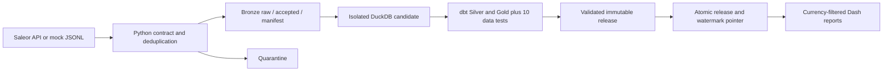

# Saleor Analytics Demo

A Principal Data Engineer interview demo: Saleor GraphQL, a Python Click CLI,
dbt, DuckDB, Airflow and Plotly Dash. All data is synthetic and all project
content is in English.

## Start here

- [New PC handoff](HANDOFF.md): fresh setup, repeatable demo, Airflow run, and
  runtime data that Git does not transfer.
- [Runnable modern DE demonstration](docs/MODERN_DE_DEMO.md): replay, updates,
  incremental extraction, quarantine and Airflow.
- [CLI user guide for Git Bash](docs/CLI_USER_GUIDE.md): environment setup, commands, and mock ingestion use cases.
- [CLI user guide for PowerShell](docs/CLI_USER_GUIDE_WINDOWS.md): the same workflow with Windows commands.
- [Assessment A-F review](docs/ASSESSMENT_REVIEW.md): requirements and remaining boundaries.
- [Operations](docs/OPERATIONS.md) and [Saleor setup](SALEOR_SETUP.md).
- [Original design](DEMO_DESIGN.md) and [implementation plan](IMPLEMENTATION_PLAN.md).

## Quick start without Docker

Install Python 3.12 and uv, then run from the repository root in either shell.
`uv sync --frozen` is required only for the first setup or after `uv.lock`
changes; it may download packages. If the cached `.venv` already works, skip
that step. Use `uv sync --frozen --offline` to check the cache without network
access; it fails quickly if a dependency is missing.

PowerShell:

```powershell
# First setup only.
uv sync --frozen
$demoSession = [guid]::NewGuid().ToString('N')
$env:ANALYTICS_ROOT = Join-Path (Get-Location) "var/demo-$demoSession"
uv run saleor-analytics mock-data "$env:ANALYTICS_ROOT/base.jsonl" --count 20
uv run saleor-analytics ingest-file "$env:ANALYTICS_ROOT/base.jsonl" --snapshot-id base
uv run saleor-analytics build-warehouse --release-id base
uv run saleor-analytics status
uv run saleor-analytics dashboard
```

Git Bash:

```bash
# First setup only.
uv sync --frozen
export ANALYTICS_ROOT="$(pwd -W)/var/demo-$(date +%Y%m%d-%H%M%S)"
uv run saleor-analytics mock-data "$ANALYTICS_ROOT/base.jsonl" --count 20
uv run saleor-analytics ingest-file "$ANALYTICS_ROOT/base.jsonl" --snapshot-id base
uv run saleor-analytics build-warehouse --release-id base
uv run saleor-analytics status
uv run saleor-analytics dashboard
```

Open http://localhost:8050. Expected: 20 orders, USD400 gross order value.
Stop on an unexpected nonzero exit code. The mock generator creates local
Saleor-shaped JSONL; it does not modify Saleor. For a real API source and Airflow,
follow the linked guides. Clone with `--recurse-submodules` for the pinned
upstream Saleor development stack.

## Architecture and guarantees



Same-input retries reuse snapshots; exact duplicates collapse; conflicting
versions fail. Invalid rows are quarantined, with a configurable reject threshold.
Current-state models select the complete latest order and line set. Both build
and direct publication require checksum-bound dbt evidence. Failed validation
or publication preserves the previously served release and source checkpoint.

Incremental API polling uses `updatedAt`, persisted bounds and five-minute
overlap. This is not log CDC: hard deletes and every intermediate mutation are
not captured. dbt rebuilds from accepted history at this scale. Silver and Gold
tables use DuckDB native storage. Exporting validated tables to Parquet for
other analytical engines is planned, not implemented.

### DuckDB schemas and tables

Each validated release stores its analytical tables in
`releases/<release-id>/analytics.duckdb`. The dbt target schema is `analytics`.
In the DuckDB CLI, address the models as `analytics.<table_name>` (some clients
show the fully qualified form as `analytics.analytics.<table_name>` because the
database catalog is also named `analytics`).

| Layer | Schema | Table | Grain / purpose |
|---|---|---|---|
| Silver | `analytics` | `orders` | One current, trusted version per Saleor order. |
| Silver | `analytics` | `order_lines` | One current line per current order version. |
| Gold | `analytics` | `daily_order_metrics` | Daily order count, gross value, and average order value by channel and currency. |
| Gold | `analytics` | `daily_product_metrics` | Daily units and gross value by product, channel, and currency. |

Bronze evidence is file-based rather than a DuckDB table: raw and accepted
JSONL plus a manifest are stored under `bronze/<snapshot-id>/`.

Example inspection commands:

```sql
show tables from analytics;
select * from analytics.orders limit 10;
select * from analytics.daily_order_metrics order by order_date;
```

Airflow orders preparation, ingestion, staging, dbt, publication and monitoring.
Mock generation is optional and restricted to manual runs. Dash reloads one
release every 30 seconds, with matching currency/channel/date filters for KPIs
and charts. Gross order value excludes draft/canceled orders; it is not recognized
revenue. No conversion or cross-currency total is implied.

## Validation and delivery

Run these commands from either PowerShell or Git Bash:

```bash
uv run ruff format --check src tests dags
uv run ruff check src tests dags
uv run pytest -q
uv build
```

Tests include real dbt builds and publication-failure recovery. GitHub Actions
validates pull requests and main; GitLab CI is an alternative example. The manual
production environment job is a promotion illustration, not a deployed service;
configure repository protection/reviewers separately. Runtime data, local secrets,
and AI configuration/prompt logs are ignored by Git.

The demo uses local filesystem locks, a single-node warehouse and environment
secrets. HA, cloud IAM, external alert delivery, retention enforcement, source
completeness guarantees and a 4 GB full-stack acceptance test remain outside
implemented scope. Use a fresh data root for contract v2; legacy snapshots are
not silently upgraded.
