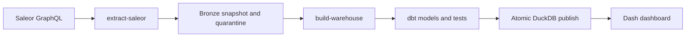

# Operational design

## Airflow

`dags/saleor_analytics.py` defines a daily batch workflow:

The extractor retries only read-only GraphQL queries. It writes a completed manifest only after every page is available; failed or partial extracts have no publish step. The DAG has one active run to keep release ordering simple. A re-run receives a new snapshot ID and replays all approved snapshots into a fresh candidate, so it never mutates a previous bronze extract.

For a backfill, trigger the DAG with an explicit logical date and a distinct run ID. Inspect the release candidate and dbt results before publishing it. In a larger deployment, run each backfill in an isolated compute pool and promote the candidate only after the normal data-quality gate succeeds.

The optional Saleor synthetic-data bootstrap is intentionally outside the scheduled DAG: initialize it once using the official `populatedb` command described in the README. This avoids accidental production-like data mutation during a scheduled analytics run. If a sandbox needs resettable seed data, add a separately permissioned Airflow task calling Saleor's management command with an explicit `seed=true` DAG parameter.

## Freshness, observability and lineage

The snapshot manifest records source checksum, extraction time, record counts, reject rate, contract version, and quality-gate status. These fields link each Gold model back to its Bronze snapshot. A production deployment exports them as OpenTelemetry/OpenLineage events and alerts when:

- the successful snapshot is older than the 06:30 UTC freshness SLO;
- reject rate exceeds the configured 5% threshold;
- accepted record volume changes materially from the trailing baseline; or
- dbt tests or the atomic publication step fail.

## Security and governance

Saleor credentials come from `SALEOR_TOKEN` or runtime-only environment variables. Git ignores local data, `.env` files, Python environments and Codex/ChatGPT artifacts. The extractor selects no customer names, emails, addresses, or private metadata. Production access should use a read-only service account, TLS, encrypted storage, least-privilege warehouse roles, secret-manager injection, and audit logging for releases and dashboard access.

## Cost and scale

This demo chooses DuckDB because the source has tens of synthetic orders and the dashboard needs compact local aggregates. It replays immutable snapshots for clarity. At scale, Bronze becomes partitioned object storage, the version table becomes an incremental Iceberg/warehouse table clustered by `updated_at` and order ID, and dbt processes only changed partitions. Lifecycle rules expire raw and quarantine data according to policy; the dashboard reads Gold aggregates, never raw order payloads.
